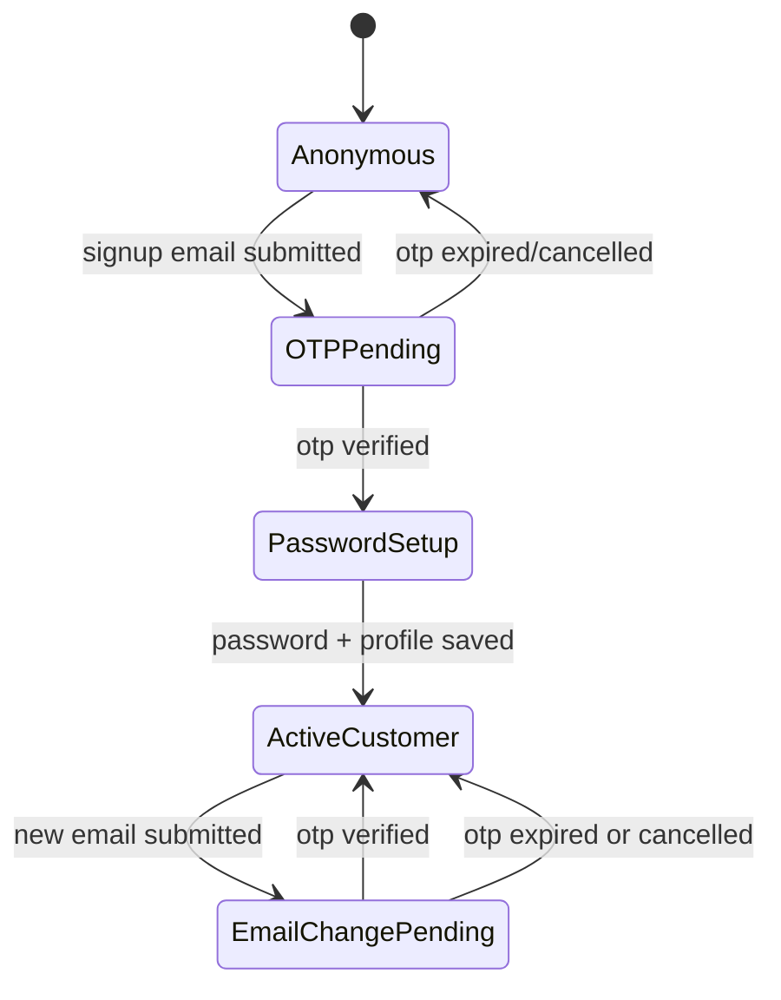
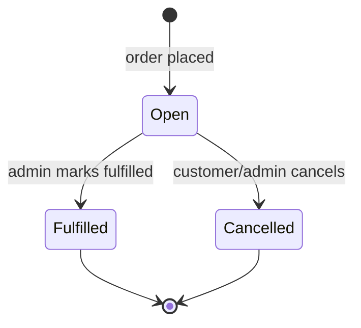
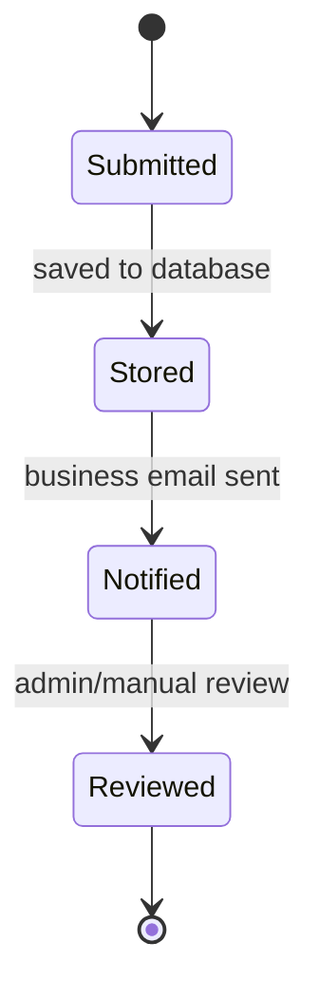

## Overview

This Functional Specification defines the detailed product behavior for `e-commerce-site` and bridges the approved PRD to implementation-ready behavior definitions. It is the source of truth for page behavior, user flows, validation rules, permissions, system notifications, and state transitions for the v1 release.

PRD reference: [01_prd.md](./01_prd.md)

This document incorporates the resolved product clarifications provided after the PRD was generated:
- Tax is calculated per product based on that product's tax rate.
- Customers can maintain multiple addresses and choose a default address.
- Order placement triggers both confirmation email and manual phone follow-up.
- `Printing supplies` is a blank public page in v1.
- Contact submissions are both stored and emailed.
- All admin product fields are mandatory.
- Facebook login is feature-flagged and may be disabled until approval is complete.
- Customer cancellation of an open order requires a cancellation action and supports an optional reason.

## User Flows

### UF-001 Landing and Product Discovery

1. User lands on `/`.
2. User sees navbar, carousel, and featured product cards.
3. User scrolls to browse cards or uses navbar search/category navigation.
4. User clicks a product card.
5. System navigates to the product detail page.

### UF-002 Search from Navbar

1. User enters a keyword in the navbar search field.
2. User submits via Enter or search icon.
3. System routes to `/products?q=<term>`.
4. Product list loads with search results and filter panel.
5. URL remains shareable and restorable.

### UF-003 Browse by Category from Navbar

1. User hovers or taps `Book Store`.
2. System displays all supported categories.
3. User selects a category.
4. System routes to `/products?category=<selected-category>`.
5. Product list renders with category pre-filter applied.

### UF-004 Filtered Catalog Browsing

1. User opens `/products` directly or arrives from search/navigation.
2. User applies one or more filters for category, level, theme, and size.
3. System updates the product grid and syncs selected filters into query params.
4. User paginates result pages as needed.
5. User adds a product to cart or opens the detail page.

### UF-005 Product Detail and Add to Cart

1. User opens `/products/?slug=<slug>`.
2. System displays gallery, zoomable main image, product data, pricing, stock state, and add-to-cart button.
3. User changes image via thumbnails and uses zoom on the main image.
4. User clicks `Add to Cart`.
5. Cart state updates and system shows success feedback.

### UF-006 Cart Review

1. User opens `/cart` from navbar/cart icon.
2. System shows line items, quantity controls, subtotal, tax, coupon section, and final total.
3. User updates quantity or removes an item.
4. System recalculates totals instantly in UI and confirms server-authoritative totals at checkout.
5. User proceeds to checkout.

### UF-007 Signup with OTP

1. Visitor opens `/signup`.
2. User enters email and requests OTP.
3. System sends email OTP if email is unused.
4. User submits OTP.
5. System verifies OTP and reveals password/profile completion step.
6. User sets password and required profile fields.
7. Account is created and user is signed in.

### UF-008 Facebook Login

1. Visitor opens `/login` or `/signup`.
2. If the Facebook feature flag is enabled, the Facebook login option is visible.
3. User selects Facebook login and completes provider authorization.
4. System creates or links the account and signs the user in.
5. If feature flag is disabled, the option is hidden entirely.

### UF-009 Account Management

1. Authenticated user opens `/account`.
2. System defaults to `My profile` tab.
3. User switches between `My profile`, `My address`, and `My orders`.
4. User updates profile or password, manages multiple addresses, or reviews order history.
5. If user changes email, system starts OTP re-verification.

### UF-010 Checkout and Order Placement

1. User opens `/checkout` from cart.
2. If cart is empty, system redirects to `/cart` with an error message.
3. If unauthenticated, system routes user to login and returns them to checkout after success.
4. User selects or adds an address, optionally applies one coupon code, and reviews totals.
5. System calculates tax per line item using each product's tax rate.
6. User places the order.
7. System creates an `Open` order, sends confirmation email, and records order for manual follow-up.

### UF-011 Customer Order Cancellation

1. Authenticated user opens `My orders`.
2. User selects an order with status `Open`.
3. User clicks `Cancel order`.
4. System asks for confirmation and optional reason.
5. User confirms.
6. System changes order status to `Cancelled`, stores the optional reason, and refreshes the order timeline.

### UF-012 Contact Inquiry Submission

1. Visitor opens `/contact`.
2. User views address, embedded map, and social links.
3. User fills name, email, phone number, and message.
4. User submits the form.
5. System validates fields, stores the inquiry, sends a business notification, and shows a success message.

### UF-013 Admin Authentication and Catalog Management

1. Admin opens `/admin/login`.
2. Admin authenticates successfully.
3. System routes to `/admin` dashboard or default management page.
4. Admin navigates to products or categories management.
5. Admin creates, edits, or deletes records.
6. System validates all required fields and persists changes.

### UF-014 Admin Sales Order Management

1. Admin opens `/admin/orders`.
2. System lists orders with status, customer, totals, and timestamps.
3. Admin opens order details.
4. Admin changes status to `Fulfilled` or `Cancelled` if allowed.
5. System saves the change and records the acting admin for audit.

### UF-015 Forgot Password

1. Visitor opens `/login` and clicks the forgot password link.
2. System routes to `/forgot-password`.
3. User enters their registered email and submits.
4. System sends an OTP to the email if an account exists; response is always the same regardless of whether the email is found (prevents account enumeration).
5. User is routed to the OTP entry screen.
6. User submits the OTP.
7. System verifies the OTP and returns a short-lived `otp_token`; system routes the user to the password reset form.
8. User enters and confirms the new password and submits.
9. System resets the password, revokes all existing refresh tokens for the account, and routes the user to `/login` with a success message.

## Screen / Page Inventory

| Route | Purpose | Key UI Elements | Auth |
|------|---------|-----------------|------|
| `/` | Landing page and entry point | Navbar, carousel, featured product cards, footer | Public |
| `/products` | Search and browse catalog | Search results header, left filter panel, product grid, pagination | Public |
| `/products/?slug=<slug>` | Product detail view | Image gallery, zoom area, price, stock, metadata, add-to-cart button | Public |
| `/cart` | Review cart | Line items, quantity controls, remove action, totals, coupon input, checkout CTA | Public |
| `/checkout` | Confirm address, coupon, totals, and place order | Address selector, address form, coupon field, tax summary, order summary, place order CTA | Authenticated |
| `/login` | Customer login | Email/password form, forgot password link, Facebook login when enabled | Public |
| `/signup` | Customer registration | Email OTP step, OTP form, password setup form, Facebook login when enabled | Public |
| `/account` | Customer account shell | Tab navigation for profile, address, orders | Authenticated |
| `/account/profile` or account tab | Manage user profile | First name, last name, phone, email, password controls | Authenticated |
| `/account/addresses` or account tab | Manage saved addresses | Address cards, add/edit form, default selector, delete action | Authenticated |
| `/account/orders` or account tab | Order history | Paginated order list, order detail drawer/page, cancel CTA for open orders | Authenticated |
| `/contact` | Business contact page | Address block, map embed, social links, contact form | Public |
| `/about` | Company information | Static content blocks | Public |
| `/terms` | Legal terms | Static terms content | Public |
| `/privacy` | Privacy policy | Static privacy content | Public |
| `/wall-of-fame` | Placeholder promotional page | Static/dummy content, image/text sections | Public |
| `/printing-supplies` | Placeholder page for future section | Blank or placeholder content with shared layout | Public |
| `/admin/login` | Admin authentication | Admin login form | Public |
| `/admin` | Admin landing page | Summary cards or direct navigation tiles | Role-gated: Admin |
| `/admin/products` | Product management | Product table, filters, create/edit modal or page, delete action | Role-gated: Admin |
| `/admin/products/new` | Create product | Full product form, image uploader, save action | Role-gated: Admin |
| `/admin/products/?id=<id>` | Edit product | Pre-filled product form, update action | Role-gated: Admin |
| `/admin/categories` | Category management | Category table, create/edit/delete controls | Role-gated: Admin |
| `/admin/orders` | Order management | Orders table, status filters, detail links | Role-gated: Admin |
| `/admin/orders/?id=<id>` | Order detail and status update | Order summary, customer info, address, status control, audit metadata | Role-gated: Admin |

## Feature Specifications

### FS-001 Global Navigation and Footer

- Trigger / entry point: Rendered on all public pages.
- Happy path: User navigates via top-level links, category dropdown, or search; system routes immediately and preserves context through URL params.
- Error states and messages:
  - If search term is empty, do not navigate; show no error.
  - If target category has no products, load catalog page with empty state message: `No products found for this selection.`
- Edge cases:
  - Mobile navbar uses expandable drawer instead of hover.
  - `Printing service` link may be present without dropdown behavior in v1.
  - `Printing supplies` opens a blank placeholder page.
- Validation rules:
  - Search query max length: 100 characters.
  - Only supported category values are accepted in category routes.

### FS-002 Landing Page

- Trigger / entry point: User opens `/`.
- Happy path: Carousel auto-advances and supports manual navigation; product cards display featured or recent items; card click opens product detail.
- Error states and messages:
  - If featured products fail to load, show `Products are temporarily unavailable.`
  - If carousel images fail, render fallback banner.
- Edge cases:
  - If fewer than 3 featured products exist, render available cards without layout break.
  - Out-of-stock products may appear but must be visually marked.
- Validation rules:
  - Carousel images require alt text and destination URL or product reference.

### FS-003 Product Listing

- Trigger / entry point: Search submission, category navigation, direct visit to `/products`.
- Happy path: System reads query params, loads matching products, and renders filters plus paginated grid.
- Error states and messages:
  - Invalid query param values are ignored and removed on next state sync.
  - If no results match, show `No products match your filters.` with a `Clear filters` action.
- Edge cases:
  - Filter combinations may yield zero results.
  - Direct deep links with multiple query params must restore identical UI state.
  - Add-to-cart on out-of-stock items is disabled.
- Validation rules:
  - Page number must be a positive integer.
  - Category must be one of the configured categories.
  - Level, theme, and size must match existing filter values returned by the backend.

### FS-004 Product Detail

- Trigger / entry point: Product card click or direct route visit.
- Happy path: System loads product, displays gallery and details, and allows add-to-cart if in stock.
- Error states and messages:
  - Missing product slug returns 404 page.
  - Unavailable product returns `This product is no longer available.`
- Edge cases:
  - Product with one image still renders zoom on main image.
  - Large images should lazy load secondary thumbnails.
- Validation rules:
  - Quantity added from detail page defaults to 1 and cannot exceed available stock.

### FS-005 Cart

- Trigger / entry point: Add-to-cart action or direct visit to `/cart`.
- Happy path: User views items, edits quantity, removes products, sees updated totals, and proceeds to checkout.
- Error states and messages:
  - Empty cart state message: `Your cart is empty.`
  - If a product becomes unavailable, show `This item is no longer available and was removed from your cart.`
- Edge cases:
  - Duplicate adds merge quantities rather than duplicate lines.
  - Quantity updates beyond stock are capped and message shown.
- Validation rules:
  - Minimum quantity is 1.
  - Maximum quantity is available stock.

### FS-006 Customer Authentication

- Trigger / entry point: User chooses login, signup, or forgot password.
- Happy path: Email signup requires OTP verification before password creation; login accepts valid credentials; Facebook login is shown only when feature flag is on; forgot password follows the 3-step OTP flow in UF-015.
- Error states and messages:
  - Existing email on signup: `An account already exists for this email.`
  - Wrong or expired OTP: `Invalid or expired OTP.`
  - Invalid credentials: `Email or password is incorrect.`
  - Password and confirm password mismatch on reset: `Passwords do not match.`
- Edge cases:
  - OTP resend allowed after cooldown.
  - Facebook feature disabled means button is hidden, not disabled.
  - Forgot password OTP request always returns the same response regardless of whether the email is registered (prevents account enumeration).
  - Successful password reset revokes all existing refresh tokens for the account; user must log in again.
- Validation rules:
  - Email must be valid format.
  - Password minimum 8 characters.
  - OTP is numeric and expires after 10 minutes.
  - `confirm_new_password` must exactly match `new_password` on the reset form.

### FS-007 Account Management

- Trigger / entry point: Authenticated visit to `/account`.
- Happy path: User updates profile, manages multiple addresses, sets one default address, reviews paginated orders, and cancels open orders if needed.
- Error states and messages:
  - Invalid address form shows inline field errors.
  - Attempt to cancel non-open order: `Only open orders can be cancelled.`
  - Email change without OTP completion keeps old email active and shows `Verify your new email to complete the change.`
- Edge cases:
  - If default address is deleted, system asks user to select a new default.
  - Optional cancellation reason may be blank.
- Validation rules:
  - Profile fields: first name, last name, phone, and email required.
  - Address Line 1, City, State, Pincode, and Phone required; Address Line 2, Landmark, Company Name, GST Number optional.
  - Pincode must be 6 digits.
  - Phone must be 10 to 15 digits.

### FS-008 Checkout and Coupons

- Trigger / entry point: User clicks `Proceed to Checkout` from cart.
- Happy path: Authenticated user selects default or alternate address, optionally applies one coupon, reviews tax-inclusive totals, and places order.
- Error states and messages:
  - Empty cart redirect message: `Add items to your cart before checkout.`
  - Invalid coupon: `Coupon code is invalid.`
  - Ineligible coupon: `This coupon cannot be applied to your order.`
  - Expired coupon: `This coupon has expired.`
- Edge cases:
  - Flat coupon discount cannot reduce order below zero.
  - Coupon recalculates after cart quantity changes.
  - Product-level tax rates may differ within the same order.
- Validation rules:
  - Exactly zero or one coupon per order.
  - Order cannot be placed without at least one valid address.
  - Server recalculates subtotal, tax, discount, and final amount before persisting order.

### FS-009 Contact and Static Content Pages

- Trigger / entry point: User opens any informational page.
- Happy path: Static pages load immediately; contact page accepts valid inquiry and confirms submission.
- Error states and messages:
  - Contact form validation error: `Please correct the highlighted fields.`
  - Submission failure: `We could not send your message right now. Please try again later.`
- Edge cases:
  - Map embed unavailable still leaves address visible.
  - Social links open in a new tab.
- Validation rules:
  - Name, email, phone, and message are required.
  - Message max length: 2000 characters.

### FS-010 Admin Product and Category Management

- Trigger / entry point: Admin authentication success.
- Happy path: Admin creates, edits, and deletes products/categories through admin pages.
- Error states and messages:
  - Unauthorized access redirects to `/admin/login`.
  - Duplicate category name: `Category already exists.`
  - Missing required product field: `All product fields are required.`
- Edge cases:
  - Deleting a category used by products should be blocked with `Reassign products before deleting this category.`
  - Product deletion should require confirmation.
- Validation rules:
  - Product name, slug, category, level, theme, size, price, discount, stock, tax rate, description, and at least one image are mandatory.
  - Price and stock must be non-negative.
  - Discount must be between 0 and product price if absolute, or 0 to 100 if percentage model is later introduced.

### FS-011 Admin Sales Order Management

- Trigger / entry point: Admin opens `/admin/orders`.
- Happy path: Admin reviews orders, opens details, and updates status with audit logging.
- Error states and messages:
  - Invalid status transition rejected with `This status change is not allowed.`
- Edge cases:
  - Cancelled orders cannot move back to Open.
  - Fulfilled orders are read-only for customer cancellation.
- Validation rules:
  - Only admins can update order status.
  - Status must be one of `Open`, `Fulfilled`, or `Cancelled`.

## State Diagrams

### Customer Account Signup and Email Change

### Order Lifecycle

### Contact Inquiry Lifecycle

## Notifications & Emails

| Event | Trigger | Recipient | Channel | Content Outline |
|------|---------|-----------|---------|-----------------|
| Signup OTP | User requests signup verification | Customer | Email | OTP code, expiry time, support contact |
| Signup success | Account created after OTP and password | Customer | Email | Welcome message, account confirmation, login link |
| Email change OTP | User changes account email | New email address | Email | OTP code, expiry time, note that old email stays active until verified |
| Password reset OTP | User submits forgot-password request | Customer | Email | OTP code, expiry time, note that if they did not request this they can safely ignore it |
| Order confirmation | Order successfully placed | Customer | Email | Order number, items, address, tax, discount, total, next steps |
| Order follow-up task | Order successfully placed | Internal business team | Internal process/manual queue | Customer name, phone, order number for manual phone follow-up |
| Contact inquiry alert | Contact form submitted successfully | Business inbox | Email | Sender details and message |
| Contact acknowledgment | Contact form submitted successfully | Customer | Email, optional | Thank-you note and expected response window |
| Admin login alert | Optional future hardening | Admin/security inbox | Email/log only | Login timestamp and actor |

## Permissions Matrix

| Role | Action | Resource | Allow |
|------|--------|----------|-------|
| Visitor | View | Public pages | Yes |
| Visitor | Search/browse | Product catalog | Yes |
| Visitor | Add/update cart | Cart | Yes |
| Visitor | Access checkout | Checkout page | No |
| Visitor | Submit contact form | Contact inquiry | Yes |
| Visitor | Sign up/login | Customer auth | Yes |
| Customer | View/edit own profile | Account profile | Yes |
| Customer | View/manage own addresses | Account addresses | Yes |
| Customer | Set default address | Own address book | Yes |
| Customer | View own orders | Order history | Yes |
| Customer | Cancel own open order | Own order | Yes |
| Customer | Cancel fulfilled/cancelled order | Own order | No |
| Customer | Manage products/categories | Admin resources | No |
| Customer | Access admin routes | Admin portal | No |
| Admin | Access admin portal | Admin routes | Yes |
| Admin | CRUD | Products | Yes |
| Admin | CRUD | Categories | Yes |
| Admin | View/update | Sales orders | Yes |
| Admin | Update customer profile data directly | Customer account pages | No, unless future back-office scope is added |
| Admin | Place customer order through storefront | Storefront as regular user | Not in admin role scope |

## Data Retention & Deletion

- Customer account records: Retain while account is active and for 7 years after last order or account closure because order and tax records may be business-critical.
- Address book records: Retain while linked to an active account; soft-delete user-removed addresses unless referenced by a past order, in which case the historical snapshot on the order remains immutable.
- Orders: Retain for 7 years from order creation. Orders are never hard-deleted in v1.
- Order cancellation reasons: Retain with the order record for the same 7-year period.
- Contact inquiries: Retain for 2 years from submission, then eligible for deletion or archival.
- OTP records: Retain only until expiry plus audit buffer; purge after 30 days.
- Auth logs and admin audit logs: Retain for 1 year for troubleshooting and security review.
- Cart data: Retain until order placement or 30 days of inactivity for guest carts and authenticated carts without completed purchase.
- Product and category records: Soft-delete in admin where feasible to preserve referential integrity and auditability.
- User-initiated deletion behavior: v1 does not support full self-service account deletion. A manual support-led deletion process may anonymize profile data while preserving legally required order records.
