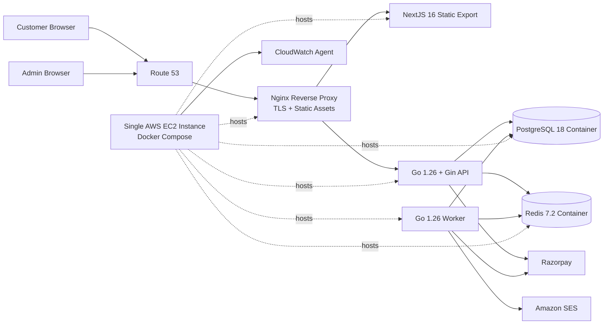
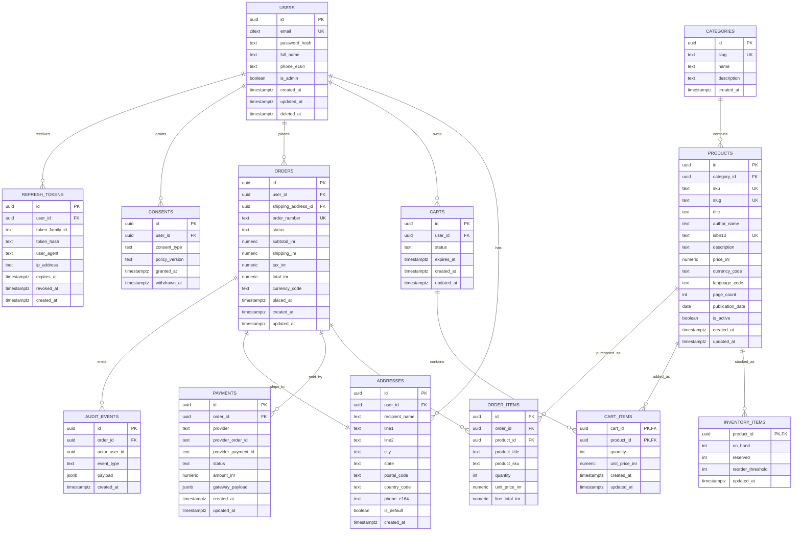
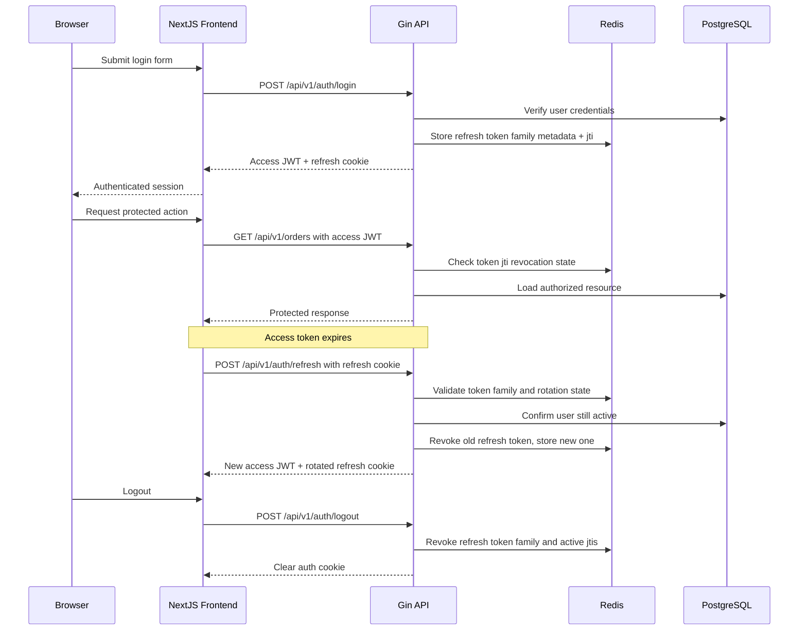

# Technical Architecture — e-commerce-site

## 1. System Overview

`e-commerce-site` is a books-focused e-commerce platform built for a modest but real production workload: roughly 100 concurrent users, low-to-moderate catalog churn, and strict correctness requirements around cart, checkout, payment confirmation, and order lifecycle. The architecture is intentionally conservative. It prioritizes operational simplicity, data integrity, and security over distributed-system complexity.

The initial production deployment uses a single AWS EC2 instance running the full application stack with Docker Compose. The frontend is a statically generated NextJS 16 storefront served by Nginx from the same host. The backend is a Go 1.26 API built with Gin and run in its own container. A separate Go worker container handles asynchronous jobs. PostgreSQL and Redis also run on the same EC2 instance with persistent storage on EBS-backed volumes.

This is the right architecture for the stated scale and current delivery maturity. A single EC2 host minimizes moving parts, keeps operational ownership simple, aligns directly with Docker Compose-based local development, and avoids premature investment in load balancers, managed queues, and multi-service orchestration. It also leaves a clean upgrade path: PostgreSQL and Redis can be externalized first, then the API and worker can move to ECS once throughput, reliability, or deployment frequency justify the added complexity.

## 2. Component Breakdown

### Frontend

- Technology: NextJS 16.0.x, React 19.x, Node.js 22.x build runtime
- Deployment form: static export served by Nginx from the EC2 host
- Responsibility:
  - Public storefront
  - Product listing and detail pages
  - Cart and checkout UI
  - Customer account pages
  - SEO-friendly marketing and category pages
- Interfaces:
  - Exposes prerendered HTML, JS, CSS, and images through Nginx
  - Calls backend REST APIs over HTTPS
  - Depends on backend for user-specific and transactional data

The storefront should use static generation for category pages, content pages, and product pages. Cart, account, inventory availability, and order history are dynamic and must be fetched from the API at runtime.

### Edge and Web Server

- Technology: Nginx 1.26 running on the EC2 host
- Responsibility:
  - TLS termination
  - Serve static frontend assets
  - Reverse proxy `/api/*` to the Go API
  - Apply compression, caching headers, and request size limits
- Interfaces:
  - Exposes HTTPS to browsers
  - Depends on local frontend build artifacts and the API container

Nginx is the correct initial edge layer for a single-host deployment. It keeps the stack small and gives enough control over TLS, routing, and caching without introducing a separate load balancer or CDN on day one.

### Backend API

- Technology: Go 1.26, Gin 1.11.x, pgx v5, sqlc 1.28.x, goose 3.x
- Deployment form: Docker Compose service on a single EC2 host
- Responsibility:
  - Authentication and account management
  - Catalog read APIs
  - Cart management
  - Checkout initiation
  - Order lifecycle management
  - Payment webhook processing
  - Admin APIs
- Interfaces:
  - Exposes REST endpoints under `/api/v1`
  - Depends on local PostgreSQL and Redis containers, plus Razorpay and SES

Gin is the correct framework choice because the service shape is a standard HTTP API with clear middleware requirements. `sqlc` is the correct data-access choice because this domain benefits from explicit SQL, strong query control, and compile-time typing.

### Background Worker

- Technology: Go 1.26 worker in Docker Compose on EC2
- Responsibility:
  - Consume Redis-backed jobs for email, payment reconciliation, stock release, and audit fan-out
  - Run retryable, idempotent background logic
- Interfaces:
  - Consumes Redis-backed job queues
  - Updates PostgreSQL
  - Calls SES and Razorpay

The worker must remain a separate process from the API even on one machine. That prevents synchronous traffic spikes from starving background work.

### Database

- Technology: PostgreSQL 18 container on the EC2 host with Docker named volumes on EBS-backed storage
- Responsibility:
  - System of record for users, products, carts, orders, payments, consent, and audit data
- Interfaces:
  - Accessed only by API and worker services over the internal Docker network

PostgreSQL is sufficient and appropriate at this scale. It provides relational integrity, strong transactions, JSONB where needed, and built-in full-text search for the initial catalog search workload.

### Cache and Ephemeral State

- Technology: Redis 7.2 container on the EC2 host
- Responsibility:
  - Refresh-token family state and revocation
  - Rate-limiting counters
  - Idempotency keys
  - Short-lived cache entries
  - Background job queue implementation using Redis streams
- Interfaces:
  - Accessed by API and worker only over the internal Docker network

Redis is not a secondary database. Every value stored in Redis must either expire or be safely reconstructible. AOF persistence should be enabled because Redis is also carrying the job queue in this first phase.

### Queue

- Technology: Redis Streams via Redis 7.2
- Responsibility:
  - Decouple non-blocking tasks from synchronous requests on the single host
  - Buffer retryable background jobs
- Interfaces:
  - Produced to by API
  - Consumed by worker

Redis Streams are the correct initial queue mechanism for the single-EC2 phase. They avoid introducing another moving part while still giving adequate asynchronous processing for this workload. Handlers must remain idempotent because jobs can be retried.

### Payments

- Technology: Razorpay API v1
- Responsibility:
  - Payment order creation
  - Payment confirmation and reconciliation
  - Webhook-driven status updates
- Interfaces:
  - Outbound API calls from backend
  - Inbound webhooks to backend

Razorpay is the correct opinionated payment choice for an India-first launch. It supports UPI and domestic payment behavior well and reduces integration friction.

### Email

- Technology: Amazon SES
- Responsibility:
  - Order confirmation
  - Password reset
  - Account verification
- Interfaces:
  - Invoked by worker only

### Secrets and Configuration

- Technology: SOPS-encrypted `.env` files on EC2, using `age` keys, plus AWS Systems Manager Parameter Store for non-secret values
- Responsibility:
  - Store runtime secrets separately from the Compose file
  - Keep encrypted secret material in the repository or release bundle until deployment
  - Separate secrets from low-sensitivity environment configuration
- Interfaces:
  - Read by Docker Compose services at startup

This is the simplest safe setup for a single-host system. It avoids hand-editing secrets on the box and does not require early adoption of a full cloud secret-injection stack.

### Observability

- Technology:
  - CloudWatch Agent on EC2
  - structured JSON logs from application containers
  - Prometheus-compatible metrics endpoints from API and worker
  - CloudWatch alarms
- Responsibility:
  - Centralized logs, host metrics, application metrics, and alerts

## 3. Data Architecture

The data model is centered on identity, catalog, inventory, carts, orders, payments, consent, and auditability. It is normalized enough to preserve consistency, but not abstracted into generic schemas that make query behavior hard to reason about.

### Core Data Models

#### `users`
- `id UUID`
- `email CITEXT`
- `password_hash TEXT`
- `full_name TEXT`
- `phone_e164 TEXT`
- `is_admin BOOLEAN`
- `created_at TIMESTAMPTZ`
- `updated_at TIMESTAMPTZ`
- `deleted_at TIMESTAMPTZ NULL`

Passwords must be hashed with Argon2id. `email` must be unique and case-insensitive.

#### `products`
- `id UUID`
- `category_id UUID`
- `sku TEXT`
- `slug TEXT`
- `title TEXT`
- `author_name TEXT`
- `isbn13 TEXT`
- `description TEXT`
- `price_inr NUMERIC(12,2)`
- `currency_code CHAR(3)` default `INR`
- `language_code TEXT`
- `page_count INTEGER`
- `publication_date DATE`
- `is_active BOOLEAN`
- `created_at TIMESTAMPTZ`
- `updated_at TIMESTAMPTZ`

#### `inventory_items`
- `product_id UUID`
- `on_hand INTEGER`
- `reserved INTEGER`
- `reorder_threshold INTEGER`
- `updated_at TIMESTAMPTZ`

Available stock is `on_hand - reserved`. Inventory mutation must occur in a transaction with row-level locking on the affected SKU rows.

#### `orders`
- `id UUID`
- `user_id UUID`
- `shipping_address_id UUID`
- `order_number TEXT`
- `status TEXT`
- `subtotal_inr NUMERIC(12,2)`
- `shipping_inr NUMERIC(12,2)`
- `tax_inr NUMERIC(12,2)`
- `total_inr NUMERIC(12,2)`
- `currency_code CHAR(3)`
- `placed_at TIMESTAMPTZ`
- `created_at TIMESTAMPTZ`
- `updated_at TIMESTAMPTZ`

`status` should be a database enum with values such as `pending_payment`, `paid`, `packed`, `shipped`, `delivered`, `cancelled`, `payment_failed`, `refunded`.

#### `payments`
- `id UUID`
- `order_id UUID`
- `provider TEXT`
- `provider_order_id TEXT`
- `provider_payment_id TEXT`
- `status TEXT`
- `amount_inr NUMERIC(12,2)`
- `gateway_payload JSONB`
- `created_at TIMESTAMPTZ`
- `updated_at TIMESTAMPTZ`

#### `consents`
- `id UUID`
- `user_id UUID`
- `consent_type TEXT`
- `policy_version TEXT`
- `granted_at TIMESTAMPTZ`
- `withdrawn_at TIMESTAMPTZ NULL`

This table is part of the DPDPA compliance baseline. Consent must be auditable, versioned, and time-stamped.

### Indexing Strategy

The indexing strategy should be explicit and workload-driven:

- `users(email)` unique btree
- `products(sku)` unique btree
- `products(slug)` unique btree
- `products(isbn13)` unique btree where not null
- `products(category_id, is_active)` btree
- `products(is_active, created_at desc)` btree
- `orders(user_id, created_at desc)` btree
- `orders(order_number)` unique btree
- `payments(provider_order_id)` unique btree
- `payments(order_id, status)` btree
- `cart_items(cart_id)` btree
- `refresh_tokens(user_id, expires_at)` btree
- `consents(user_id, consent_type, granted_at desc)` btree
- `audit_events(order_id, created_at desc)` btree

For search, use PostgreSQL full-text search. Create a generated `tsvector` column on `products` combining `title`, `author_name`, `description`, and `isbn13`, indexed with GIN. That is the correct first-stage search design for this scale.

### Migration Strategy

Use `goose` for ordered SQL migrations. The migration policy is:

1. All production schema changes are forward-only.
2. Destructive changes use expand-and-contract rollout steps.
3. Application releases must be compatible with the current and immediately previous schema during deployment.
4. Seed data migrations are kept separate from structural schema migrations.
5. Large index changes use concurrent creation where supported.

Migrations should run explicitly on the EC2 host during deployment using a dedicated one-shot application container. Long-running API and worker containers must not auto-run migrations on startup.

## 4. API Design Principles

The API style is REST. It should not use GraphQL and should not use RPC. This domain is transactional and resource-oriented. REST gives predictable caching behavior, simpler logs, simpler auth boundaries, and easier contract evolution for a conventional storefront.

### Resource Structure

The API root is `/api/v1`. Representative resources:

- `POST /api/v1/auth/register`
- `POST /api/v1/auth/login`
- `POST /api/v1/auth/refresh`
- `POST /api/v1/auth/logout`
- `GET /api/v1/products`
- `GET /api/v1/products/{slug}`
- `GET /api/v1/categories`
- `GET /api/v1/cart`
- `POST /api/v1/cart/items`
- `PATCH /api/v1/cart/items/{productId}`
- `DELETE /api/v1/cart/items/{productId}`
- `POST /api/v1/checkout`
- `GET /api/v1/orders`
- `GET /api/v1/orders/{orderId}`
- `POST /api/v1/payments/webhooks/razorpay`

### Versioning Strategy

Use URI versioning with `/api/v1`. It is operationally simple, explicit in logs, and easy to route through Nginx location rules. Breaking changes require `/api/v2`.

### Pagination Pattern

Use cursor pagination for all lists that can grow meaningfully:

- `GET /products?limit=24&cursor=<opaque>`
- `GET /orders?limit=20&cursor=<opaque>`

The cursor should encode a stable sort key such as `(created_at, id)` or `(title, id)` depending on the endpoint. Offset pagination is acceptable only for low-volume internal admin views.

### API Conventions

- JSON request and response bodies only
- RFC 7807-style error envelope
- `Idempotency-Key` required on checkout and payment-initiation endpoints
- Server-side prices and totals are authoritative
- Strict transport-layer validation
- Unknown fields rejected on mutating endpoints

## 5. Authentication & Authorization Flow

Use short-lived access JWTs and rotating refresh tokens. Access tokens are signed with `EdDSA (Ed25519)`. Refresh tokens are opaque random values, hashed before persistence. JWTs must not be stored in `localStorage`. The frontend should keep access tokens in memory. Refresh tokens should be delivered in `HttpOnly`, `Secure`, `SameSite=Lax` cookies where domain topology allows.

### Authorization Model

Use role-based authorization with two initial roles:

- `customer`
- `admin`

Role claims may be included in JWTs, but resource ownership checks must still be enforced server-side. Authorization logic belongs in service-layer code, not only middleware.

## 6. Infrastructure & Deployment

### Environment Topology

Three environments are still required, but the topology stays intentionally simple at the start:

- `dev`: local Docker Compose with frontend, API, worker, PostgreSQL, Redis, and MailHog
- `staging`: one smaller EC2 instance running the full stack with test payment credentials
- `prod`: one larger EC2 instance running the full stack with daily backups and monitoring

Staging remains mandatory. Payment webhooks, CORS, cookie behavior, and reverse-proxy routing need an environment that behaves like production before changes are promoted.

### Container and Runtime Configuration

#### Local

Docker Compose services:

- `frontend`
- `api`
- `worker`
- `postgres`
- `redis`
- `mailhog`

#### AWS

Single-host production baseline:
- EC2 instance family: `t4g.large` for staging, `t4g.xlarge` for production
- OS: Ubuntu Server 24.04 LTS
- Runtime: Docker Engine 28.x + Docker Compose v2
- Reverse proxy: Nginx on host network or dedicated container bound to ports 80 and 443
- Storage: gp3 EBS volume mounted for PostgreSQL data, Redis persistence, uploaded assets, and backups

Container layout on the host:
- `nginx`: serves static frontend output and proxies API requests
- `frontend-build`: optional build-only container for generating static assets during release
- `api`: Go Gin application
- `worker`: Go background worker
- `postgres`: PostgreSQL 18 with persistent named volume mapped to EBS-backed storage
- `redis`: Redis 7.2 with AOF enabled for queue durability
- `backup`: scheduled backup container running `pg_dump` and rotation scripts

### Secrets Management

Use encrypted `.env` files on the EC2 host for the first phase. The practical implementation is:

- Store production and staging secrets as SOPS-encrypted files
- Decrypt them only on the target EC2 host during deployment
- Mount them into Docker Compose through `env_file` references
- Keep JWT signing keys, database passwords, Razorpay credentials, and SMTP secrets out of the Compose YAML itself

Use SSM Parameter Store only for non-secret environment values such as domain names, rate-limit defaults, and feature flags. Secrets must never be baked into images or exposed through frontend build artifacts.

### Deployment Pipeline Overview

CI/CD is currently absent, so the initial release process is manual but standardized:

1. Build versioned Docker images for `api` and `worker`.
2. Build the NextJS static export.
3. Copy the release bundle or pull images onto the EC2 host.
4. Decrypt the environment file on the target host.
5. Run database migrations using a one-shot application container.
6. Restart or recreate Compose services with `docker compose up -d`.
7. Run smoke tests against the public domain and the health endpoint.

This is acceptable only temporarily. The first follow-up should be a GitHub Actions pipeline that builds images, packages the frontend, ships artifacts to the host, and executes the deployment steps over SSH in a controlled way.

## 7. Observability

Observability must be present from day one because checkout and payment issues are expensive even at modest traffic.

### Logging

Use structured JSON logs only. Required fields:

- `timestamp`
- `level`
- `service`
- `environment`
- `request_id`
- `trace_id`
- `user_id` when authenticated
- `order_id` and `payment_id` when applicable

Sensitive fields such as tokens, passwords, addresses, and raw payment payloads must be redacted.

### Metrics

Track at minimum:

- request rate
- request latency by route
- 4xx and 5xx counts
- login success/failure rate
- checkout success rate
- payment callback processing latency
- worker queue lag
- DB connection pool saturation
- Redis memory usage
- cache hit ratio
- EC2 CPU, memory, disk, and filesystem usage

### Tracing

Instrument API and worker with OpenTelemetry and emit traces only when an OTLP collector is introduced later. For the initial single-host phase, structured logs and metrics are the primary observability tools. Traces should eventually include:

- request entry
- database queries
- Redis calls
- queue publish and consume
- payment provider calls
- email dispatch

### Alerting

CloudWatch alarms via SNS for:

- EC2 CPU or memory pressure
- disk usage on the EBS volume
- API p95 latency breach
- checkout error-rate breach
- PostgreSQL container restart or health failure
- Redis container restart or health failure
- failed migration run

## 8. Security Considerations

### Threat Model Highlights

Highest-risk threats:

- credential stuffing and account takeover
- forged or replayed payment webhooks
- checkout tampering through manipulated client totals
- JWT theft via XSS or bad storage practices
- PII leakage through logs or backups
- admin privilege escalation
- single-host compromise affecting the entire stack
- inventory oversell under concurrent checkout

### Input Validation

Validate every request at the transport boundary with strict schemas. Unknown fields on mutating endpoints should be rejected, not ignored. Treat user-supplied text as plain text unless rich content is explicitly required.

### Rate Limiting

Use Redis-backed rate limiting:

- auth endpoints: per-IP and per-account throttles
- catalog endpoints: soft per-IP limits
- checkout/payment-initiation: strict per-user and per-IP limits
- webhook endpoints: provider validation plus signature verification and Nginx request-size limits

### CORS

Allow only exact known origins for storefront and admin UI. No wildcard origins. No wildcard headers. No credentialed cross-origin requests unless explicitly required.

### CSP

Use a strict Content Security Policy:

- `default-src 'self'`
- `script-src 'self'` plus explicitly required Razorpay origins
- `style-src 'self' 'unsafe-inline'` only if build output requires it
- `img-src 'self' data: https:`
- `connect-src 'self' https://<domain> https://*.razorpay.com`
- `frame-src` restricted to payment provider origins

### DPDPA Controls

To align with DPDPA:

- collect only necessary personal data
- record consent type, version, and timestamp
- support deletion or anonymization workflows where legally permitted
- define retention windows for customer and audit data
- encrypt in transit and at rest
- restrict production-data access
- audit administrative access to personal data
- encrypt backups stored off-host

## 9. Scalability & Performance

### Caching Strategy

Use layered caching:

- Nginx static file caching headers for HTML, JS, CSS, and images
- browser caching for immutable fingerprinted assets
- Redis for popular anonymous catalog fragments with 60 to 300 second TTLs
- no cache for personalized order and account endpoints

Product detail and category pages should be statically generated. At this scale, do not add regeneration infrastructure beyond rebuilding and redeploying the frontend when catalog content changes materially.

### DB Connection Pooling

Use `pgxpool` with explicit limits:

- `max_conns: 20` per API process
- `min_conns: 4`
- `max_conn_lifetime: 30m`
- `max_conn_idle_time: 5m`

Because the app and database live on one host, connection churn will be low. The main concern is protecting PostgreSQL from unbounded app-side pools, not network fan-out.

### Web and Static Delivery

Nginx should cache-control:

- immutable static assets for one year
- prerendered HTML conservatively, typically `no-cache` with ETag for simpler release behavior
- no authenticated API responses

### Bottleneck Analysis

Most likely bottlenecks:

1. Database contention around inventory and order creation
2. Payment provider latency
3. Unindexed catalog search
4. Single-host resource contention between Nginx, API, worker, PostgreSQL, and Redis
5. Side effects leaking into synchronous request paths

Mitigations:

1. Use transactional inventory updates with row locks only on touched SKUs.
2. Keep payment initiation minimal and move retries and reconciliation to the worker.
3. Enforce query review and index discipline.
4. Reserve CPU and memory limits per container and monitor disk I/O closely.
5. Keep email and audit fan-out fully asynchronous.

## 10. ADR Candidates

These decisions should become ADRs in `adr/`:

1. Start with a single EC2 host running the full stack in Docker Compose before splitting services.
2. Use PostgreSQL full-text search initially instead of OpenSearch.
3. Use Ed25519-signed JWT access tokens with rotating opaque refresh tokens and Redis-backed revocation.
4. Use Razorpay as the primary payment provider for India-first launch.
5. Use SQL-first persistence with `sqlc` and `goose` instead of a Go ORM.

## Baseline Architecture Summary

This is the recommended baseline:

- NextJS 16 static storefront served by Nginx on EC2
- Go 1.26 + Gin API in Docker Compose on EC2
- separate Go worker in Docker Compose on EC2
- PostgreSQL 18 container with persistent EBS-backed storage
- Redis 7.2 container for ephemeral state, rate limiting, and job queues
- Razorpay for payments
- SES for email
- SOPS-encrypted `.env` files plus Parameter Store for configuration separation
- CloudWatch Agent and application metrics for observability

That stack is production-ready for the stated scale, matches the project constraints, and keeps the system simple enough to operate without painting the team into a corner.
